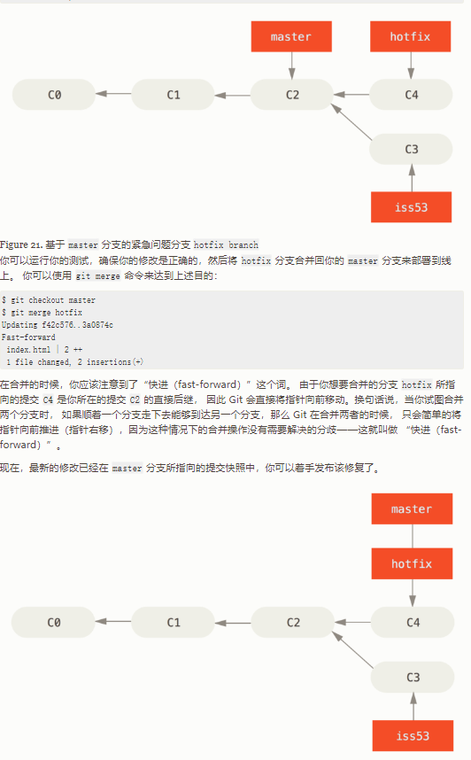
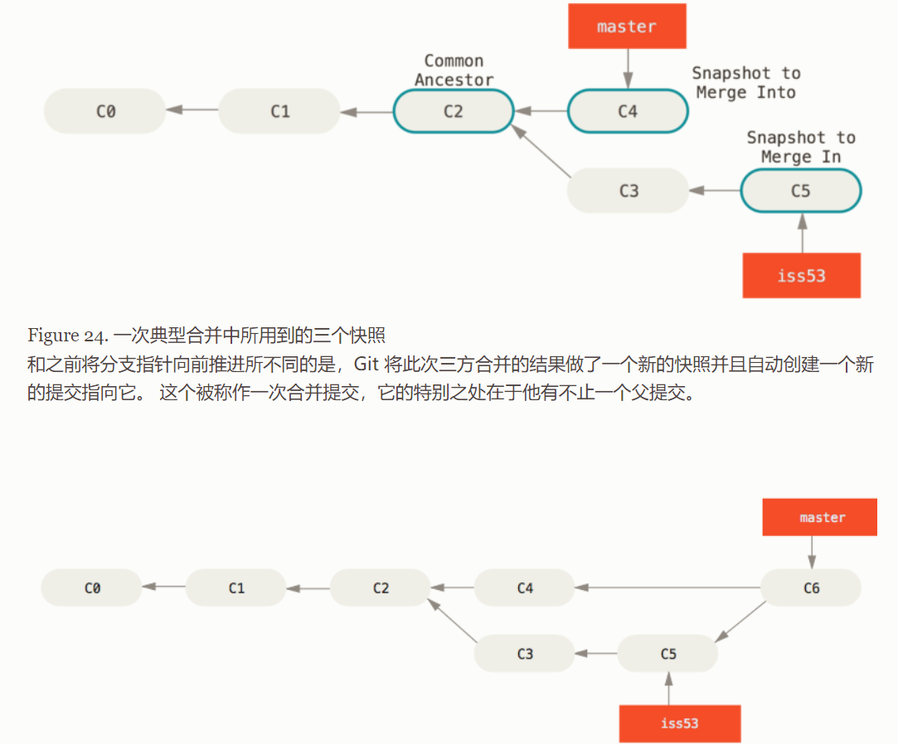
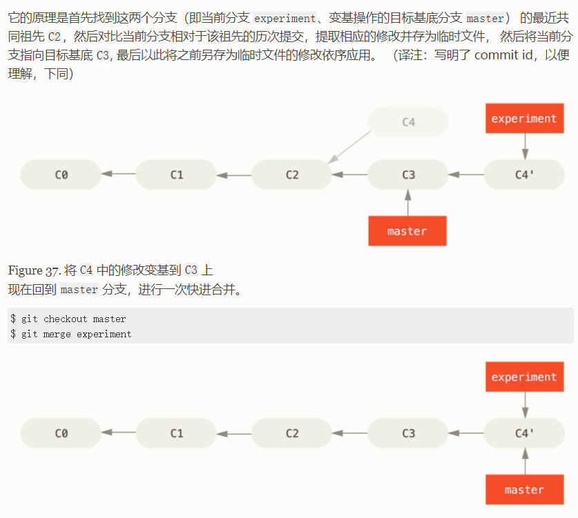

## GIT

- HEAD 指向当前所在的分支。

### git merge：

- merge的操作流程：将 `hotfix` 分支合并回你的 `master` 分支来部署到线上。 你可以使用 `git merge` 命令

  1. 首先检出你想合并入的分支，git checkou master
  2. 将需要被合并的分支合并入，git merge iss53

- merge的第一种情况：当你试图合并两个分支时， 如果顺着一个分支走下去能够到达另一个分支，那么 Git 在合并两者的时候， 只会简单的将指针向前推进（指针右移），因为这种情况下的合并操作没有需要解决的分歧——这就叫做 “快进（fast-forward）”。

  - hotfix 分支合并到 master 分支时，master 分支可以沿着提交直接走到 hotfix 分支的提交，那么master 分支将直接向前推进即可。

  

- merge的第二种情况：三方合并，做一个新的快照并且自动创建一个新的提交指向这个快照。

  - 主分支（并入的分支） master 指向这个新的提交，子分支（被并入分支）继续指向该分支上原来的最新提交快照。

  

  - 处理合并冲突的过程：如果合并它们的时候产生合并冲突，此时 Git 做了合并，但是没有自动地创建一个新的合并提交。 Git 会暂停下来，等待你去解决合并产生的冲突，使用 git status 查看哪些包含合并冲突而处于未合并（unmerged）状态的文件

    - 解决冲突的步骤：

      1. 手动打开包含冲突的文件。

      2. 寻找文件中 git 加入的标准冲突解决标记

      3. 手动解决冲突。

         ```c
         <<<<<<< HEAD:index.html
         <div id="footer">contact : email.support@github.com</div>
         =======
         <div id="footer">
          please contact us at support@github.com
         </div>
         >>>>>>> iss53:index.html
         ```

         - ====的上半部分 HEAD 是你希望合并入的分支所在的版本的提交信息。
         - ====的下半部分是希望被合并的分支所在的版本的提交信息。

      4. 必须选择使用由 `=======` 分割的两部分中的一个，或者你也可以自行合并这些内容。

      5. 对每个文件使用 `git add` 命令来将其标记为冲突已解决。 一旦暂存这些原本有冲突的文件，Git 就会将它们标记为冲突已解决。

      6. 再次运行 `git status` 来确认所有的包含合并冲突而处于未合并（unmerged）状态的文件都已被解决。

### 什么是冲突(Merge conflict)：

- 在两个不同的分支中，对同一个文件的同一个部分进行了不同的修改，Git 就没法干净的合并它们(Automatic merge failed)，产生合并冲突，合并失败。

### git rebase：

子分支 `C4` 提交中引入的补丁和修改，然后在主分支目前的 `C3` 提交的基础上应用一次。 在 Git 中，这种操作就叫做 **变基（rebase）**。 你可以使用 `rebase` 命令将提交到某一分支上的所有修改都移至另一分支上，就好像“重新播放”一样。

- rebase 的操作流程：
  1. 检出子分支 experiment 分支，git checkout experiment 
  2. 将子分支的所有修改提交，变基到主分支 master 分支，git rebase master。
     - 主分支指向原来的提交位置（变基前的提交位置，没有移动），变基的子分支指向最新的提交快照。
     - 1和2的命令可以缩写为 git rebase master experiment，省略切换到变基分支的操作。
  3. 最后切换到主分支 master 快进合并主分支到最新的提交快照：git checkout master / git merge experiment

- 工作与原理：

  1. 找到这两个分支的最近公共祖先。
  2. 对比两个分支相对于该祖先的历次提交，提取出变基分支的相应修改并存为临时文件。
  3. 将当前变基分支指向主分支的当前提交上（指向变基分支的新目标基底），最后变基分支在新的目标基底上将之前另存为临时文件的修改重新依次应用，重做之前的提交。

  

### merge 和 rebase 的区别

- 变基是将一系列提交按照原有次序依次应用到另一分支上，而合并是把最终结果合在一起。
- rebase 使用原则：只对尚未推送或分享给别人的本地修改执行变基操作清理历史， 从不对已推送至别处的提交执行变基操作。

## 创建一个 git 项目

```shell
# 切换到一个目录上
git init

# 完全（本地目录和git控制）删除文件
git rm filename
# 要删除之前修改过或已经放到暂存区的文件，必须使用强制删除选项 -f
git rm -f filename
# 将文件在git控制中删除（后续考虑添加到.gitignore文件中，那么 git status 就不会一直提示这个文件是未跟踪的）
git rm --cached filename


# 重命名git控制中的文件（一劳永逸）
git mv filename
# 外部重命名git控制的文件（原始工序）
mv oldFilename newFilename
git rm oldFilename
git add newFiename


# 名为 origin 的远程上拉取名为 master 的分支到本地分支 origin/master 中
git fetch origin master 
# 合并名为 origin/master 的分支到当前所在分支
git merge origin/master 
# 推送本地的 master 分支到远程 origin
git push origin master
# 一次性拉取多个分支的代码
git fetch origin master stable oldstable
# 一次性合并多个分支的代码
git merge origin/master hotfix-2275 hotfix-2276 hotfix-2290
# 抓取所有的远程仓库
git fetch --all


# 与给定的远程仓库同步数据,抓取远程仓库有而本地没有的数据。
git fetch <remote>
# 添加一个新的远程仓库引用到当前的项目
git remote add <remote> <url>
# 推送分支
git push <remote> <branch>


# 从一个远程跟踪分支检出一个本地分支会自动创建所谓的“跟踪分支”（它跟踪的分支叫做“上游分支”）。
method1：git checout -b serverfix origin/serverfix
method2：git checout --track origin/serverfix 
method3：git checkout serverfix # 这三种都是同样的效果，创建同名的跟踪分支。
# 跟踪分支是与远程分支有直接关系的本地分支
# 如果在一个跟踪分支上输入 git pull，Git 能自动地识别去哪个服务器上抓取、合并到哪个分支。
# 设置已有的本地分支跟踪一个刚刚拉取下来的远程分支，或者想要修改正在跟踪的上游分支
git branch -u origin/serverfix / git branch --set-upstream-to origin/serverfix

# 本地的每一个分支正在跟踪哪个远程分支与本地分支是否是领先、落后或是都有
git branch -vv


# 显示需要读写的远程仓库——使用 Git 保存的仓库简写与其对应的 URL
git remote -v

# 从最初克隆的服务器上抓取数据并自动尝试合并到当前所在的分支。
git pull 

# 查看某一个远程仓库的更多信息
git remote show <remote>

# 解释以下这些

git remote set-head origin -a
```


> --decorate：在提交记录上标明现在有那些分支是指向它的。
>
> 切换分支时的注意事项：
>
> - 切换分支之前，要保持好一个干净的状态。你的工作目录和暂存区里那些还没有被提交的修改， 它可能会和你即将检出的分支产生冲突从而阻止 Git 切换到该分支。
>  - 将他们 statsh 或着 commit 起来。
> - 切换分支的时候，Git 会重置你的工作目录，使其看起来像回到了你在那个分支上最后一次提交的样子。
> 

```shell
# 查看 commitId 的短位数形式
git log --abbrev-commit --pretty=oneline
# 检视 commit 信息
git show commitId
# 检视 topic 分支指向的 commit 信息
git show topic

# 查看祖先提交的 commit 信息
git show HEAD^3 	# 第一父提交的第一父提交的第一父提交
git show HEAD~3 	# 同义
git show HEAD~~~ 	# 同义

# git stash
git stash save 被 git stash push 取而代之，因为 push 引入了贮藏选定的路径规范的选项。


# 从工作目录中移除没有忽略的未被追踪文件
git clean -f -d
# -n：做一次演习然后告诉你 将要 移除什么”。
# -n 替代 -f 表示做一次演习。
```


## 恢复内容：

git checkout master：checkout 是改变 HEAD 自身指向哪个分支。

git reset master：reset 是改变 HEAD 指向的那个分支的指向。

git checkou -- file 像 `reset` 一样不会移动 HEAD。 它就像 `git reset [branch] file` 那样用该次提交中的那个文件来更新索引 Index，但是它也会覆盖工作目录中对应的文件。像是 `git reset --hard [branch] file`（如果 `reset` 允许你这样运行的话）， 这样对工作目录并不安全，它也不会移动 HEAD。


> git add 和 git checkout 的 --patch 选项