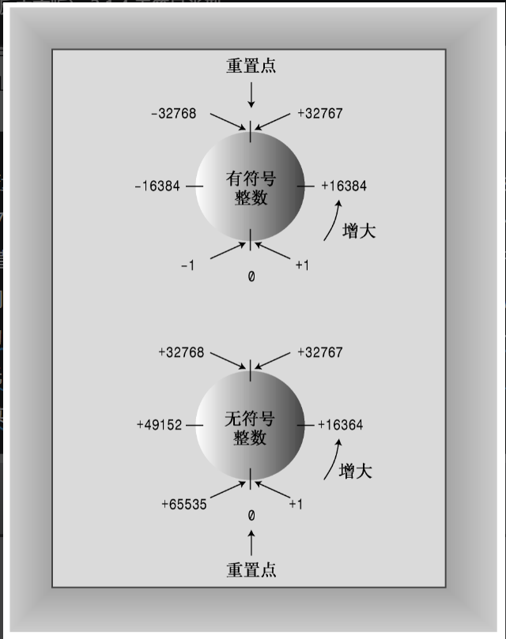
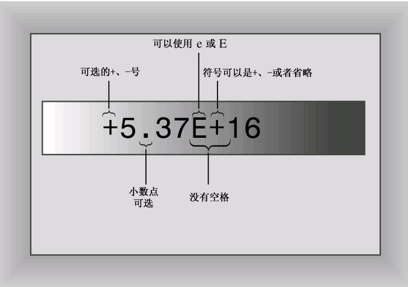

- 16 位（有符号）：32767，32位（有符号）：2147483647。

- short至少16位； int至少与short一样长； long至少32位，且至少与int一样长； long long至少64位，且至少与long一样长。

- 当变量的值超出当前整型数据类型可存储数字的最大范围限制时，其值将转化为另一端范围的取值。C++确保无符号类型的这种行为；但并不保证符号整型超越限制（上溢和下溢）时不出错。



- 普选首选 `int` 这个自然整型长度，如果变量表示的值不可能为负，选无符号类型，可以表示更大的值。
- 如果大于 16 位整数的最大可能值，则建议使用 long，提高程序的可移植性。
  - 因为 long 规定至少需要 32 位来存储，int 至少 16 位且可变为 24、32 位。当系统发生移植，例如从 32 位移植到 16 位，int 类型表示的整数值如果原先表示一个超过 16 位整数范围但是小于 32 位的整数，那么这时候就会发生变量表示的整数值错误，不再是我们预期的那个整数值。
- 变量可能表示的整数值小于 16 位整数的最大可能值可以选用 short ，short 比 int 的表示数值范围小，且希望能省一点内存是一点才用 short 。
- 存储的数值超过 200 亿才使用 long long。
- 只需要一个字节时才使用 char。


- 整型常量默认存储为 int 类型，整数后面的 l 或 L 后缀表示该整数为 long 常量。u 或 U 后缀表示 unsigned 。ul 或 UL 后缀表示 unsigned long 。ull 或 ULL 后缀表示 unsigned long long （任何一种顺序，大小写均可）。
- 十六进制数 0x9C40（40000）将被表示为 unsigned int 。因为十六进制常用来表示内存地址，而内存地址是没有符号的，因此，unsigned int 比 long 更适合用来表示16位的地址。


- 如果使用 char 变量来存储标准 ASCII 字符，char 变量有没有符号都没有关系，char 类型默认是既不是有符号的也不是无符号的。
- 如果使用 char 存储数字时，当要存储像 200 那么大的值，在某些系统可以用，在某些系统可能不可以用，使用 unsigned char （0~255）可以实现所有系统的适配性。signed char （-128~127） 

```c++
bool is_ready = true;
int ans = true; 	 // assigned 1
int promise = false; // assigned 0
bool start = 100; 	 // true
bool stop = 0;		 // false
```

- 使用 `const type name = value;` 取代 `#define` 进行定义符号常量。 


- float 至少32位，通常为 32 位，有效数字位数为 6 位。

- double 至少48位，且不少于float，通常为 64 位，有效数字位数为 15 位。

- long double 至少和 double 一样多。通常为 80、96 或 128 位，有效数字位数为 18 位

- 这3种类型的指数范围至少是 −37 到 37 。

- 有效数字位数是该数据类型你可以表示一个很大很大的数字，但是它有效的精确的数字个数只有效位数哪几位而已。对非有效位数内的数字进行算数计算，不会对整个数字的值有任何影响。

  

  > 5.37 是尾数（mantissa），16 是指数（exponent）。

- 浮点常量默认存储为 double 类型，如果需要存储为 float 类型，在数字后加上 f 或 F 后缀。如果需要存储为 long double 类型，添加 l 或 L 后缀。


数组

​	`typename arryName[arraySize];`

- sizeof 运算符返回类型或数据对象的长度（单位为 字节）。
  - 如果将 sizeof 运算符用于数组名，得到的将是整个数组中的字节数。但如果将 sizeof 用于数组元素，则得到的将是元素的长度 （单位为字节）。

字符串

- C-stye String

  - `char fish[] = "Bubbles" ;` 或 `char bird[11] = "Mr. cheeps";` 自动添加字符串末尾的 `\0` 标识 。

  -  "s" 表示的是字符串所在的内存地址，他由两个字符 's' 和 '\0' 组成。

  - 字符串输入：

    ```c++
    - cin 使用空白（空格、制表符和换行符）来确定字符串的结束位置，cin 不会读取这个空白（空格、制表符和换行符）。这意味着cin在获取字符数组输入时只读取一个单词。读取该单词后，cin 将该字符串放到数组中，并自动在结尾添加空字符 '\0'。
    - cin 读取字符串不能避免将长度大于字符数组长度的输入字符串，放入字符串数组中，这样会出错。
        
    为了增强 cin 的功能就有两个以下两个函数: 
        
    getline() 和 get() 都是读取一行输入，直到到达换行符（读取换行符）。随后 getline() 将丢弃换行符（用空字符来替换换行符），而 get() 将换行符保留在输入序列中（不读取换行符）。
    - getline(): 接收两个参数，第一个参数是用来存储输入行的数组的名称，第二个参数是要读取的字
    符数。如果这个参数为20，则函数最多读取19个字符，余下的空间用于
    存储自动在结尾处添加的空字符。getline()成员函数在读取指定数目的
    字符或遇到换行符时停止读取。
    - get() 读取一行后，将换行符保留在输入序列中，下一个 get() 读到换行符以为读取结束，存储空行到字符数组中。造成阻碍了接下来的换行输入。get() + 使用不带任何参数的 cin.get() 调用 = getline()
    不带任何参数的 cin.get() 调用可读取下一个字符（即使是换行符），因此可以用它来处理换行符，为
    读取下一行输入做好准备。
    ```

    ```c++
    cin.get(name,ArgSize);
    cin.get();
    // 支持链式编程，可使用以下写法替换。
    cin.get(name,ArgSize).get();
    ```

    ```shell
    - get() 由于不读取换行符，会出现读取到空行的情况，读取空行时，get() 方法会设置失效位，关闭读取输入序列中的字符。需要调用一次 cin.clear(); 恢复继续读取输入的字符。
    getline() 由于会读取换行符所以，读取空行后将换行符更换成字符串末尾标识，紧接又从下一行读起，不会设置失效位。
    cout << "Enter your address: " << endl;
    cin.get(address,ArgSize); // 输入一个换行空行
    cin.clear(); // 消除空行带来失效位置，恢复读取输入。
    cin.get(); // 将之前导致空行的剩下的换行符读取掉。
    
    - get() 当输入的字符数量比分配的数组空间多时，将读取自己规定读取的数量，然后停止读取。把多出来的留在输入序列中被别人读取。
    getline() 遇到这种情况时，与 get() 同样的处理方式，但是会设置失效位，关闭后面的字符读取输入。
    cin.clear() 也能恢复 getline() 的失效位关闭输入。
    ```

  - 数字 + 字符串的混合输入

    ```c++
    // 1.首先输入数字，Enter 提交。
    cin >> year;
    // 2.换行符还留在输入序列中。
    cin.getline(address,80);
    // 读取换行符，认为输入结束，存储空行。
    // 解决方式：使用 cin.get() 把空行给吃掉再使用 getline() 读取下一行。
    ```

-  string 类

  ```c++
  #include <iostream> // 引入 cout、cin 以及 getline(cin,str)
  #include <cstring> // 引入 c-style String 的工具方法，如 strcpy(),strcat(),strlen()
  #include <string> // 引入 string 类
  int main()
  {
      using namespace std; // string 类位于名称空间 std 中。
  	string str, str1, str2, str3; // 定义变量
      str1 = "This is a string_1"; // 赋值
      str2 = "This is a string_2";
      str = str1 + str2; // 拼接,对标 strcpy(destinationC-Str,sourceC-Str);
      str += str1; // 追加,对标 strcat(destinationC-Str,sourceC-Str);
      str.size(); // 长度,对标 strlen(c-str);
      getline(cin,str3) // String 的 IO 输入，输入一行换行符为间隔。
      cin >> str3; // 输入存储单个单词到 str3 中
  }
  ```

结构体

- struct 定义和创建结构体变量
- stuct 的初始化
- struct 数组
- struct 位字段（位段）